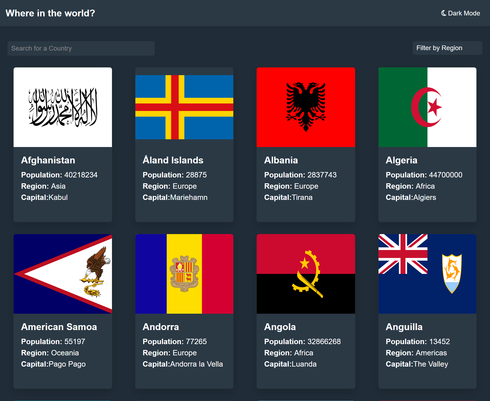
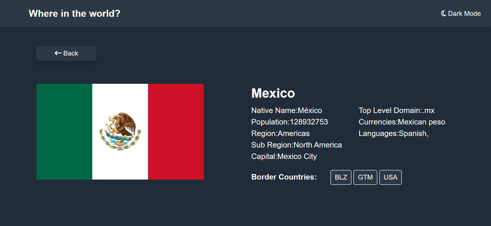

# REST Countries API with color theme switcher solution

This is a solution to the [REST Countries API with color theme switcher challenge on Frontend Mentor](https://www.frontendmentor.io/challenges/rest-countries-api-with-color-theme-switcher-5cacc469fec04111f7b848ca). Frontend Mentor challenges help you improve your coding skills by building realistic projects. 

## Table of contents

- [Overview](#overview)
  - [The challenge](#the-challenge)
  - [Screenshot](#screenshot)
- [My process](#my-process)
  - [Built with](#built-with)
  - [What I learned](#what-i-learned)
- [Style Guide](#Front-end-Style-Guide)
## Overview

### The challenge

Users should be able to:

- See all countries from the API on the homepage
- Search for a country using an `input` field
- Filter countries by region
- Click on a country to see more detailed information on a separate page
- Click through to the border countries on the detail page
- Toggle the color scheme between light and dark mode *(optional)*

### Screenshot

Light mode desktop


Light mode mobile


Dark mode desktop





Dark mode mobile


## My process

### Built with

- Semantic HTML5 markup
- CSS custom properties
- Flexbox
- CSS Grid
- Mobile-first workflow
- Php
- Js
- [Bootstrap](https://getbootstrap.com) - For styles

### What I learned
The filter method iterates over each element (in this case, each country object) in the res array. For each country, it checks if the region property of that country object is equal to the value of selectElement.value. selectElement is assumed to be a reference to an HTML <select> element, and value is the selected value of that <select> element.

So, filterCountries will be a new array containing only the country objects whose region property matches the selected value from the <select> element.

```js
const filterByRegion = async () => {
    const res = await getCountries();
    const filterCountries = res.filter(country => country.region === selectElement.value);
    draw(filterCountries);
}
```
## Front-end Style Guide

## Layout

The designs were created to the following widths:

- Mobile: 375px
- Desktop: 1440px

## Colors

### Neutral

- Dark Blue (Dark Mode Elements): hsl(209, 23%, 22%)
- Very Dark Blue (Dark Mode Background): hsl(207, 26%, 17%)
- Very Dark Blue (Light Mode Text): hsl(200, 15%, 8%)
- Dark Gray (Light Mode Input): hsl(0, 0%, 52%)
- Very Light Gray (Light Mode Background): hsl(0, 0%, 98%)
- White (Dark Mode Text & Light Mode Elements): hsl(0, 0%, 100%)

## Typography

### Fonts

- Family: [Nunito Sans](https://fonts.google.com/specimen/Nunito+Sans)
- Weights: 300, 600, 800

## Icons

- [Font Awesome](https://fontawesome.com)